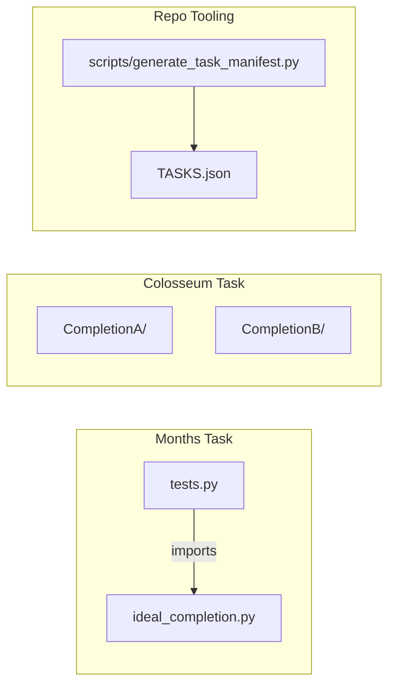
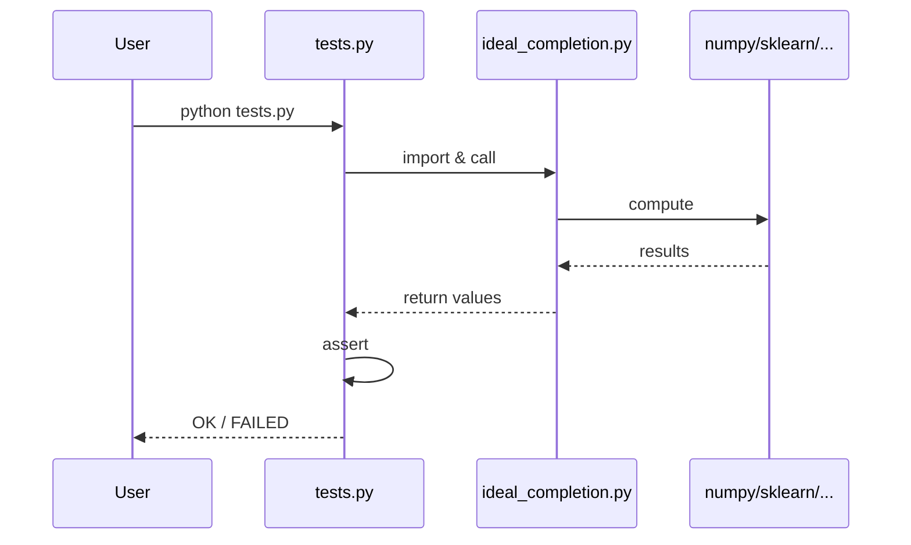
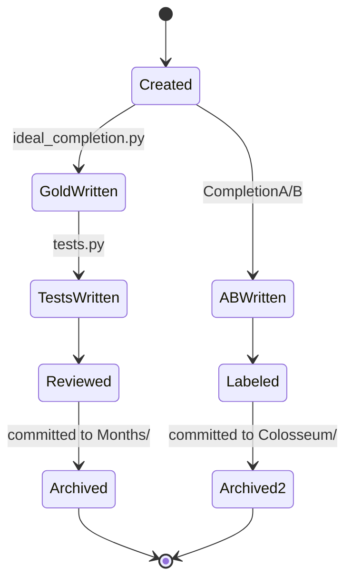

# Architecture Guide

## High-level architecture

```mermaid
flowchart TB
    subgraph External
        LLM[LLM / Chat Session]
    end

    subgraph Months Track
        IC[ideal_completion.py]
        UT[tests.py]
        IC --> UT
        UT --> V1[Pass / Fail]
    end

    subgraph Colosseum Track
        CA[Completion A]
        CB[Completion B]
        CA --- CB
        CA --> H[Human Preference]
        CB --> H
    end

    LLM --> Months Track
    LLM --> Colosseum Track
```

## Design principles

1. **Task isolation** — No shared `src/` package; each folder is self-contained.
2. **Gold + verifier** — Reference solution separated from test logic.
3. **stdlib testing** — `unittest` everywhere (not pytest at task level).
4. **A/B pairs** — Colosseum stores competing artifacts, not automated preference learning.

## Folder dependency map



**No upward dependencies** between tasks.

## Control flow (Months)



## Data flow

| Stage | Months | Colosseum |
|-------|--------|-----------|
| Input | Fixtures in `setUp()` | Prior-turn context (implicit) |
| Process | `ideal_completion` functions | Two code variants |
| Output | unittest assertions | Human label |
| Persistence | None (except TradingBot SQLite) | None |

## Lifecycle



## Component inventory

| Component | Location | Role |
|-----------|----------|------|
| Eval corpus | `Months/` | Automated QA |
| Preference pairs | `Colosseum/` | Human comparison |
| Django stub | `test/` | Scaffold only |
| Task manifest | `TASKS.json` | Machine-readable index |
| Tooling | `scripts/` | Manifest, test runner, validation |

## Most engineered subsystem

**TradingBot** (`Colosseum/V2/Week1/TradingBot/`) — modular bot with config YAML, strategies, DB, Telegram. See [projects/trading-bot.md](projects/trading-bot.md).
