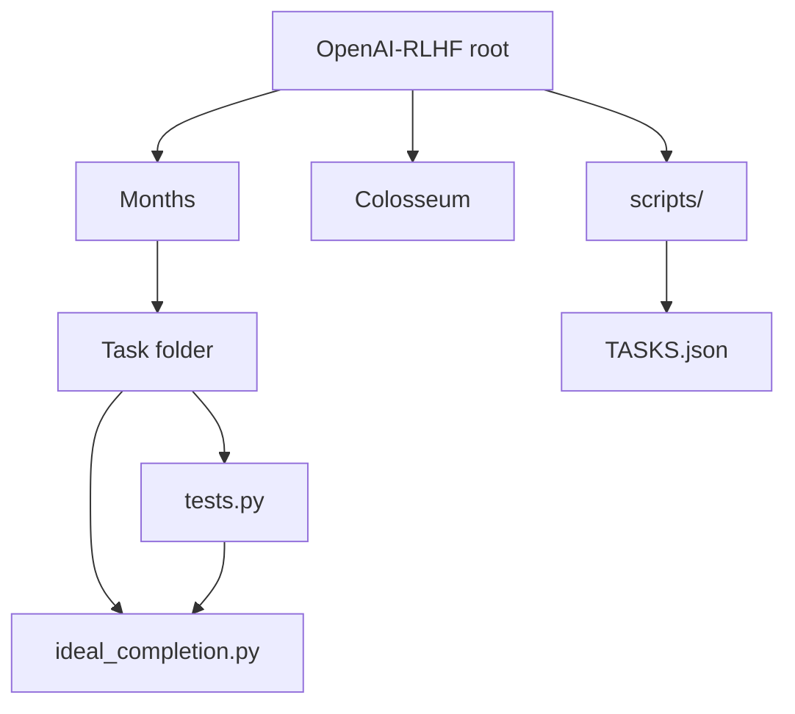

# Dependency Guide

## Overview

Dependencies are **per-task**, not centralized. This guide lists common packages by domain.

## Tooling (repo root)

```bash
pip install -r requirements-dev.txt
```

Includes: `pytest`, `numpy`, `pandas`, `scipy`, `scikit-learn`, `selenium` (optional baseline).

## Domain → packages

| Domain | Common packages | Example tasks |
|--------|-----------------|---------------|
| **Core scientific** | numpy, pandas, scipy | BondAnalyzer, Monte-Carlo |
| **ML classical** | scikit-learn | Model, RF, SEM |
| **Deep learning** | tensorflow, torch | Model, decision, torch/YOLOS |
| **Boosting** | xgboost | Month5/Edit_Review/XGBOOST |
| **NLP** | pycrfsuite, transformers | CRF, YOLOS |
| **LLM APIs** | openai | Month5/Reviews4/OpenAI_API |
| **RAG** | langchain-chroma | Month5/Reviews4/LangChain |
| **Web frameworks** | flask, django | Flask, Edit_Review/django |
| **Browser testing** | selenium, playwright | Month6 Batch3 |
| **Documents** | fpdf, reportlab, python-docx, odfpy | Flask plagiarism |
| **Plotting** | matplotlib, plotly | genetic, Annotations |
| **Trading** | ccxt, ta, python-telegram-bot, sqlalchemy, pyyaml, python-dotenv | TradingBot |
| **GUI** | PyQt5, tkinter | Month2 GUI tasks |
| **Finance** | (stdlib + numpy/scipy) | BondAnalyzer, Libor |

## TradingBot requirements

File: `Colosseum/V2/Week1/TradingBot/CompletionB/requirements.txt`

```
ccxt, pandas, ta, python-telegram-bot, sqlalchemy, pyyaml, python-dotenv
```

## Internal module graph



**No cross-task imports** at repository level.

## External libraries NOT present

| Library | Status |
|---------|--------|
| gym / gymnasium | Not used |
| stable-baselines3 | Not used |
| trl (HuggingFace) | Not used |
| ray[rllib] | Not used |
| hydra-core | Not used |
| wandb | Not used |

## Dependency resolution strategy

1. Run `python tests.py`
2. On `ModuleNotFoundError`, `pip install <package>`
3. Check task folder for local `requirements.txt` (rare except TradingBot)

## Optional: future `requirements/` extras

Suggested structure (not yet implemented):

```
requirements/
  base.txt
  ml.txt
  web.txt
  trading.txt
```
