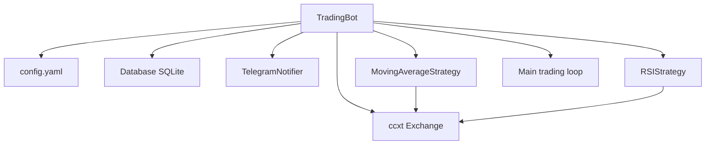

# TradingBot Subsystem

## Purpose

Most **engineered mini-application** in the repository — a Binance trading bot with configurable strategies, persistence, and notifications. Exists as **A/B completions** in Colosseum.

## Location

```
Colosseum/V2/Week1/TradingBot/
├── CompletionA/          # Flatter implementation
│   ├── binance_bot.py
│   ├── config.py
│   ├── indicators.py
│   └── utils.py
└── CompletionB/          # Modular implementation (more complete)
    ├── bot.py
    ├── config/config.yaml
    ├── requirements.txt
    ├── strategies/
    │   ├── base_strategy.py
    │   ├── moving_average.py
    │   └── rsi_strategy.py
    └── utils/
        ├── database.py
        └── telegram_notifications.py
```

## Architecture (CompletionB)



## Execution flow

1. `load_config()` — read YAML, inject env vars
2. `setup_exchange()` — ccxt Binance client
3. `Database()` — SQLAlchemy SQLite
4. `setup_strategies()` — MA + RSI if enabled
5. `run()` — poll OHLCV, generate signals, execute trades, log, notify

## Configuration

See [Configuration Guide](../09-configuration-guide.md).

## Dependencies

```bash
cd Colosseum/V2/Week1/TradingBot/CompletionB
pip install -r requirements.txt
```

## Environment variables

```
BINANCE_API_KEY
BINANCE_API_SECRET
TELEGRAM_BOT_TOKEN
TELEGRAM_CHAT_ID
```

## Running

```bash
cd Colosseum/V2/Week1/TradingBot/CompletionB
python bot.py
```

**Warning:** Connects to live exchange if `testnet: false`. Use testnet for development.

## A vs B comparison

| Aspect | CompletionA | CompletionB |
|--------|-------------|-------------|
| Structure | Flat files | Modular packages |
| Config | `config.py` | YAML + dotenv |
| Strategies | In indicators | Separate strategy classes |
| Persistence | Minimal | SQLAlchemy DB |
| Notifications | Unknown | Telegram |

## Design decisions

- **ccxt** — exchange abstraction
- **YAML config** — non-developer tunable parameters
- **Strategy pattern** — `base_strategy.py` extensibility
- **SQLite** — local trade history without external DB

## Limitations

- Not production-audited
- No backtesting framework in-repo
- No unit tests for bot logic
- API keys required for full run

## Future improvements

- Mock exchange unit tests
- Backtest mode with historical CSV
- Docker compose for isolated deployment
- Paper trading default
